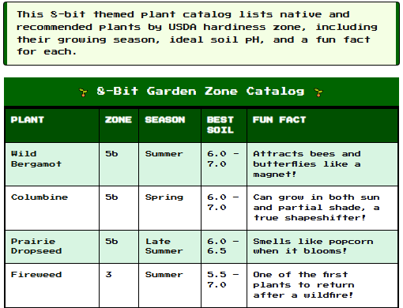

<h1>8-Bit Garden Zone Catalog</h1>

A fun, retro-style plant guide using HTML and CSS. It lists native and recommended plants by USDA hardiness zones (3–9) with info on growing season, soil pH, and fun facts. Styled with an 8-bit theme using pixel fonts and bright colors. Great for garden lovers and creative coders!

  
  
  
 <ul>
    <li>HTML and semantic table structure</li>
    <li>CSS styling</li>
    <li>Themed visual design (8-bit style)</li>
    <li>Organizing and presenting data clearly</li>
    <li>Creative user experience elements like fun facts and hover effects</li>
 </ul>
  
  
